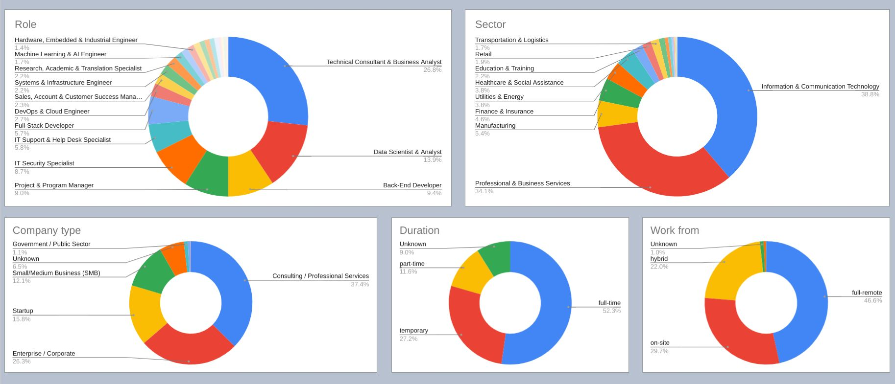
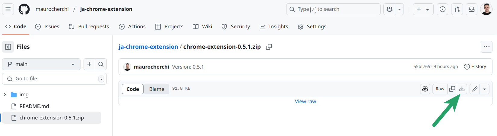
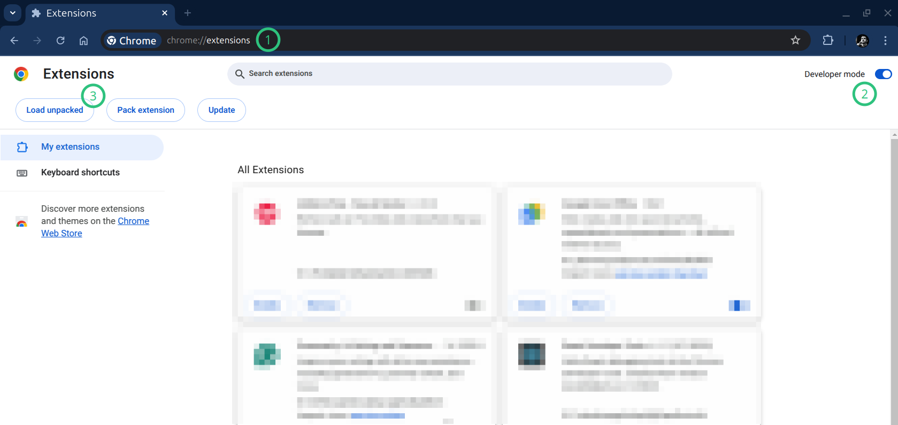
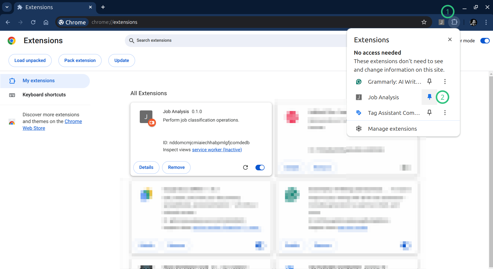
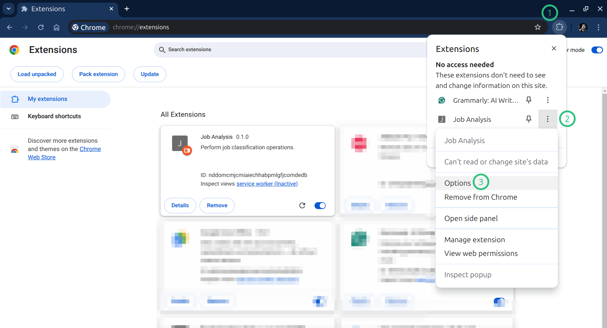
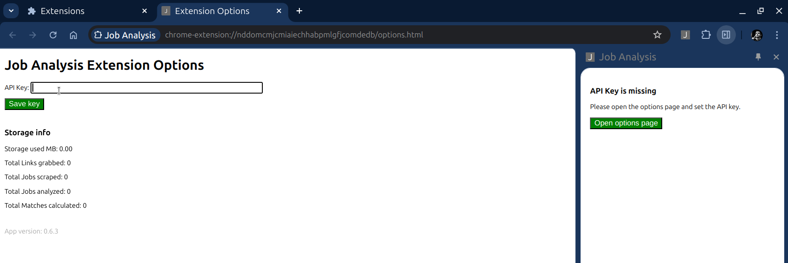
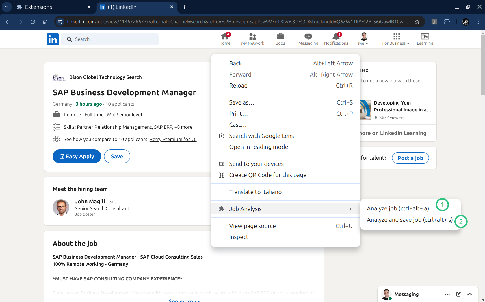
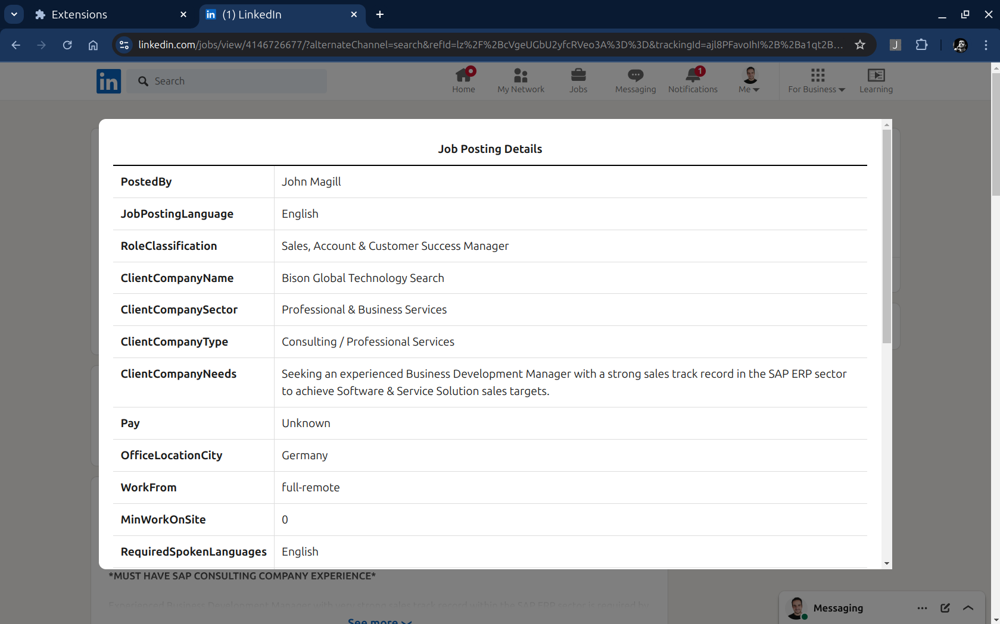
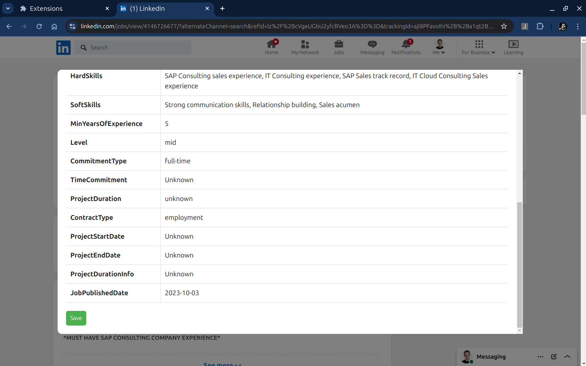
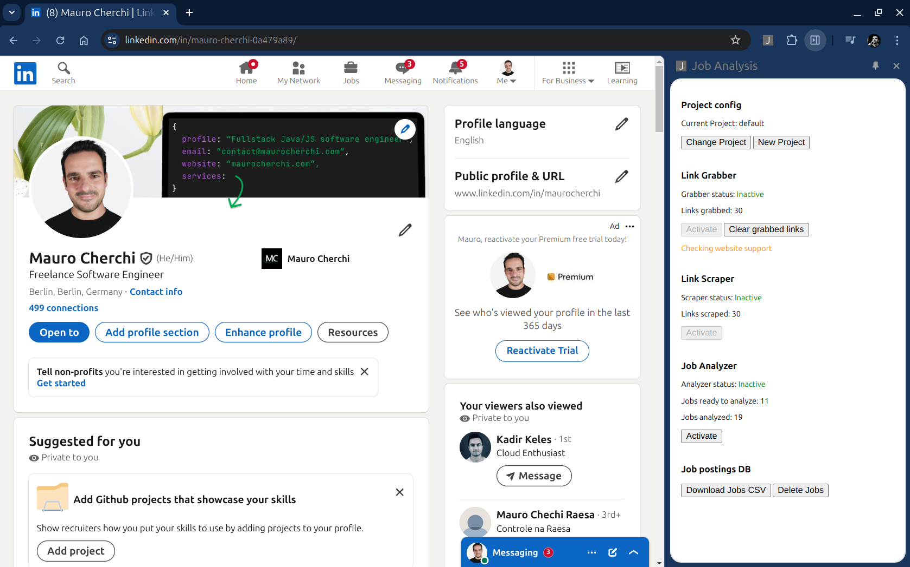

**Table of contents**
* [Installation](#installation)
* [Usage](#usage)
  * [Prerequisites](#prerequisites)
  * [Job offer analysis](#job-offer-analysis)
  * [The main panel](#the-main-panel)

# Why Job Analysis Chrome Extension

This Chrome Extension is meant to:

* 📊 Help you analyze the job market
* 🍰 Simplify the job searching process

You could find out, for example, that:

* 🌍 Berlin offers more full-remote jobs than Munich
* 📈 24% of job offers on Upwork are for website and CMS developers
* 💼 4.5% of job offers on LinkedIn come from the finance & insurance sector
* ... and much more

When you have this information, you can focus your energies on the right platform!\
Maybe on Stepstone there are more job offers for your desired role?

Once you know better the market, you can refine your search filters 🔍 and tailor your CV 📝 to target your ideal clients.\
🎯 Berliner startup in the finance sector?\
🕒 SMB part-time DevOps engineer?\
🏢 SAP consultant for corporates in the manufacturing field?\
You name it!

Once you have chosen your target client, refined your CV, found the best job platforms, 
and adjusted your filters, this extension will help you track down and identify the best offers for you. *

\* 🚧 This feature is under construction.

## Installation

Follow these easy steps:

1. 📂 Create a new folder called "chrome-extensions" on your computer 
(you can create it wherever you want, but if you are not sure, find the recommended folders a little down)
2. 📥 Download the zip file inside the newly created folder
 
3. 🗜️ Extract the zip inside the dedicated new folder (double left click or right click and "extract here")
4. ✅ A new folder with the same name as the Zip should appear
5. 🔨 Change the name of the folder to "ja-chrome-extension". (this will make updating the extension easier)
6. 🌐 Open your Chrome browser
7. Navigate to **chrome://extensions** (copy and paste into your browser navigation bar)
8. Enable Developer Mode by clicking the toggle switch next to **Developer mode**
9. Click the **Load unpacked** button and select the "ja-chrome-extension" directory
10. 🎉 The extension is now installed

If you need more details check the official Chrome guide: [Load an unpacked extension instructions](https://developer.chrome.com/docs/extensions/get-started/tutorial/hello-world#load-unpacked).

|  |
|:----------------------------------------------:|
|  _How to enable and load unpacked extensions_  |

Recommended folders:

* 🐧 **Linux:** `/home/your-username/Documents/chrome-extensions`
* 💻 **Windows:** `C:\Users\YourUsername\Documents\chrome-extensions`
* 🍏 **macOS:** `/Users/YourUsername/Documents/chrome-extensions`

## Update

Assuming you have installed the extension following the instructions you should have a "ja-chrome-extension" folder inside a "chrome-extensions" folder.\
Possibly `.../Documents/chrome-extension/ja-chrome-extension`.

To update the extension simply:
1. Remove the "ja-chrome-extension" folder
2. Download the new zip into the "chrome-extensions" folder
3. 🗜️ Extract the zip inside the dedicated new folder (double left click or right click and "extract here")
4. ✅ A new folder with the same name as the Zip should appear
5. 🔨 Change the name of the folder to "ja-chrome-extension". (this will make updating the extension easier)
6. Open the chrome://extensions 
7. Click on the rounded arrow in the extension card (the tooltip "reload" should appear when you hoover over the arrow)

## Uninstall

When you uninstall the extension all data connected to it will be lost. Make sure to download everything you need before removing the extension.

1. Open the chrome://extensions page
2. Click the "Remove" button on the extension card

## Usage

The extension can be used to:
* [Analyze single job offers](#job-offer-analysis)
* [Save the job offer analysis](#save-analysis-results)
* [Download all results as CSV](#download-results-csv)
* [Organize your saved offers into projects](#configure-the-current-project)
* [Analyze the job market](#the-market-analysis)

### Prerequisites

The first thing to do once the extension is installed is to set the API Key. 

To do that, first pin the extension 📍, then right-click on the extension icon and click Options.\
(Alternative: open the extensions menu, click on the three dots, and select Options)

|  |
|:-----------------------------:|
|      _Pin the extension_      |

|  |
|:---------------------------------------------:|
|     _Right click on the icon -> Options_      |

|          |
|:-----------------------------------------------------:|
| _(Alternative) Open options from the extensions list_ |

Once opened the Options page, enter your API Key and click Save.\
A success message should appear.

|  |
|:-----------------------------------------:|
|            _The options page_             |

Now you are ready to use the extension 🚀.

### Job Offer Analysis

The first thing you can do is analyze a job posting page.  
1. Open the page with your browser (* see note below)
2. **Right-click** on the page 
3. Hover over the **Job Analysis** menu item
4. And then select one of the following options:
   * 🧐 Analyze job 
   * 💾 Analyze and save job

\* ✅ **Note**: Fully open a job posting page, do not run the analysis on pages that contain multiple job previews e.g. linkedin.com/jobs/collections/#####. 
The right page where to run the analysis for LinkedIn is: linkedin.com/jobs/view/#####.

|      |
|:---------------------------------------------------------:|
| _Right click on the page to see the Job Analysis actions_ |

**Analyze job** will perform the analysis for the current job posting page and display the results table.

|    |
|:-----------------------------------------------------:|
|    |
|               _Analysis result example_               |

### Save analysis results

After you perform an analysis, you can save the results.\
You can save as many analysis results as you like and later download them as CSV.

By default, all results are saved in a project called "default".\
More details on how to configure the project later. 

**Analyze and save job** will perform the same operation and automatically save the result.

### The Main Panel

The main panel is the most important part of the extension.  
From here, you can manage all aspects of the plugin (except for the API key).

To open the main control panel, click on the plugin icon. A new panel should open on the right side of your screen.

|  |
|:-------------------------------------:|
|     _The main panel once opened_      |

#### Download results CSV

At the bottom of the panel you can find the "Download CSV" button.\
This button will create a CSV file that contains all analysis results saved for the currently selected project.\

https://youtu.be/HO6nchJdxqg

From here you can also delete all saved job analysis for the current project.

#### Configure the "Current Project"

At the top of the panel you can see the currently selected Project.\
If you haven't changed it yet, it shows the name: default

The project acts as a folder for your data. You can create multiple projects to organize your saved jobs however you like.
By city for example, by role, by skill... you choose.

### The market analysis

Extracting data from single job postings and saving it is useful, but what if you could analyze **your job market** situation?

You have a very specific set of skills, desires, you live in a particular place and would like to work at peculiar conditions.
Or maybe you are evaluating a change of career, or just deviate a little from what you have always done.

Using the next 3 features you can almost effortlessly gain a good understanding and a lot of insights on the  subset of the job market that you are interested in.

#### Step 1: Link Grabber

First of all, we need to collect a lot of links to job offerings we may be interested in.

Open your Job Board website (e.g. LinkedIn), open the job search page and apply the filters that define
the segment of the job market you are interested in.

Activate the link grabber and navigate through the result pages. No need to click on the links, just scroll through the result pages and open one page after the other.
The "Links grabbed" counter on the panel shows how many links to job offers have been collected (grabbed) from the page.

https://github.com/maurocherchi/ja-chrome-extension/blob/main/img/job-analysis-link-grabber.mp4

\* _This feature is available only on certain websites, but the list of supported websites is growing._
 
#### Step 2: Link Scraper

When you have collected enough links, you can enable the Link Scraper.\
The job of the scraper is to extract all the job related data from the pages behind the links we collected on the previous step.

New browser tabs will be open, one for each link, one at the time.

https://github.com/maurocherchi/ja-chrome-extension/blob/main/img/job-analysis-link-scraper.mp4

**Note**: During this process you won't be able to use the browser.

#### The "Job Analyzer"

Once the content of the job posting pages has been saved, you can start the Analyzer!

The analyzer will run in background, and you can see the number of Analyzed jobs growing.\
You can use your browser normally while the analyzer is running.

https://github.com/maurocherchi/ja-chrome-extension/blob/main/img/job-analysis-job-analyzer.mp4

You can decide to download at any moment the current list of analyzed jobs clicking the "Download jobs CSV" button.