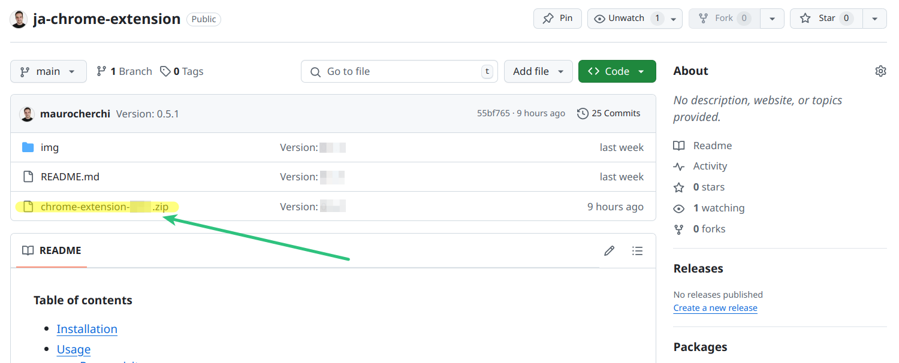
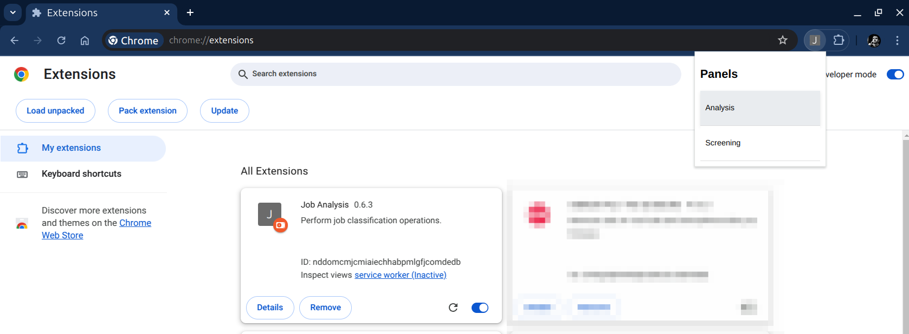

**Table of contents**
* [Overview](#why-job-analysis-chrome-extension)
* [Installation](#installation)
* [Usage](#usage)
  * [Prerequisites](#prerequisites)
  * [Analyze a job offer](#job-offer-analysis)
  * [Save the job offer analysis result](#save-analysis-results)
  * [Download results](#download-results-csv)
  * [Organize your saved offers into projects](#configure-the-current-project)
  * [Analyze the job market](#the-market-analysis)
* [Known problems](#known-problems)

# Why Job Analysis Chrome Extension

This Chrome Extension is meant to:

* 📊 Help you analyze the job market
* 🍰 Simplify the job searching process

You could find out, for example, that:

* 🌍 Berlin offers more full-remote jobs than Munich
* 💬 80% of the companies searching for your role require English fluency
* 📈 24% of job offers on Upwork are for website and CMS developers
* 💼 4.5% of job offers on LinkedIn come from the finance & insurance sector
* ... and much more

When you have this information, you can focus your energies on the right platform, city, or new skill...\
Maybe there are more job offers for your desired role on Stepstone?

Once you know the market better, you can refine your search filters 🔍 and tailor your CV 📝 to target your ideal clients.\
🎯 Berliner startup in the finance sector?\
🕒 SMB part-time DevOps engineer?\
🏢 SAP consultant for corporates in the manufacturing field?\
You name it!

Once you have chosen your target client, refined your CV, found the best job platforms,
and adjusted your filters, this extension will help you track down and identify the best offers for you. 

## Manage extension

### Installation

Follow these easy steps:

1. 📂 Create a new folder called "chrome-extensions" on your computer
   (you can create it wherever you want, but if you are not sure, find the recommended folders a little down)
2. 📥 Download the zip file inside the newly created folder
    
3. 🗜️ Extract the zip inside the dedicated new folder (double left-click or right-click and "extract here")
4. ✅ A new folder with the same name as the Zip should appear
5. 🔨 Change the name of the folder to "ja-chrome-extension". (this will make updating the extension easier)
6. 🌐 Open your Chrome browser
7. Navigate to **chrome://extensions** (copy and paste into your browser navigation bar)
8. Enable Developer Mode by clicking the toggle switch next to **Developer mode**
9. Click the **Load unpacked** button and select the "ja-chrome-extension" directory
10. 🎉 The extension is now installed

If you need more details, check the official Chrome guide: [Load an unpacked extension instructions](https://developer.chrome.com/docs/extensions/get-started/tutorial/hello-world#load-unpacked).

|  |
|:----------------------------------------------:|
|  _How to enable and load unpacked extensions_  |

Recommended folders:

* 🐧 **Linux:** `/home/your-username/Documents/chrome-extensions`
* 💻 **Windows:** `C:\Users\YourUsername\Documents\chrome-extensions`
* 🍏 **macOS:** `/Users/YourUsername/Documents/chrome-extensions`

### Install a newer version

Assuming you have installed the extension following the instructions, you should have a "ja-chrome-extension" folder inside a "chrome-extensions" folder.\
Possibly `.../Documents/chrome-extension/ja-chrome-extension`.

To update the extension:
1. Remove the "ja-chrome-extension" folder
2. Download the new zip into the "chrome-extensions" folder
3. 🗜️ Extract the zip inside the dedicated new folder (double left-click or right-click and "extract here")
4. ✅ A new folder with the same name as the Zip should appear
5. 🔨 Change the name of the folder to "ja-chrome-extension". (this will make updating the extension easier)
6. Open the chrome://extensions
7. Click on the rounded arrow in the extension card (the tooltip "reload" should appear when you hover over the arrow)

|   |
|:------------------------------:|
| _How to update the extensions_ |

### Uninstall

When you uninstall the extension, all data connected to it will be lost. Make sure to download everything you need before removing the extension.

1. Open the chrome://extensions page
2. Click the "Remove" button on the extension card

## Usage

The extension can be used to:
* [Analyze single job offers](#job-offer-analysis)
* [Save the job offer analysis results](#save-analysis-results)
* [Download all results as CSV](#download-results-csv)
* [Organize your saved offers into projects](#configure-the-current-project)
* [Analyze the job market](#the-market-analysis)
* [Create your professional profile](#analyze-profile)
* [Define your job screening rules](#screener-settings)
* [Calculate the job offer score](#the-match-analysis)

### Prerequisites

The first thing to do once the extension is installed is to set the API Key.

To do that, first pin the extension 📍

|  |
|:-----------------------------:|
|      _Pin the extension_      |

Then click the extension icon and open one of the available panels.

|                |
|:-----------------------------------------:|
|  |
|              _Open a panel_               |

Once the Options page is open, enter your API Key and click Save.

|  |
|:-----------------------------------------:|
|            _The options page_             |

A success message should appear and the side panel should update.
Now you are ready to use the extension 🚀.

## The analysis panel

You can use the job analysis panel to:
* analyze single job offers and decide which one to save
* perform a job market analysis

### Job Offer Analysis

The first thing you can do is analyze a job posting page.
1. Browse to a job posting page (* see note below)
2. Open the analysis panel
3. Click "Analyze offer"

\* ✅ **Note**: Fully open a job posting page; do not run the analysis on pages that contain multiple job previews, e.g. linkedin.com/jobs/collections/#####.
The right page where to run the analysis for LinkedIn is: linkedin.com/jobs/view/#####.

|  |
|:-------------------------------------------------------------:|
|                    _Analyze offer button_                     |

**Analyze job** will perform the analysis for the current job posting page and display the results table.

|    |
|:-----------------------------------------------------:|
|    |
|               _Analysis result example_               |

### Save analysis results

After you perform an analysis, you can save the results.\
You can save as many analysis results as you like and later download them as CSV.

By default, all results are saved in a project called "default".\
Find more details on how to configure the project below.

**Analyze and save job** will perform the same operation and automatically save the result.

### Download results CSV

At the bottom of the panel, you can find the "Download CSV" button.

|  |
|:-----------------------------------------------------------------------:|
|                             _Download CSV_                              |

This button will create a CSV file that contains all analysis results saved for the currently selected project.

|  |
|:---------------------------------------------------------------------------------------------:|
|                                      _Watch on YouTube_                                       |

From here, you can also delete all saved job analyses for the current project.

### Configure the "Current Project"

At the top of the panel, you can see the currently selected Project.\
If you haven't changed it yet, it shows the name: default

|  |
|:-------------------------------------------------------------:|
|                _Current Project configuration_                |

The project acts as a folder for your data. You can create multiple projects to organize your saved jobs however you like.
For example, by city, by role, by skill... you choose.

### The market analysis

Extracting data from single job postings and saving it is useful, but what if you could analyze **your job market** situation?

You have a very specific set of skills, desires, and you live in a particular place and would like to work at peculiar conditions.
Or maybe you are evaluating a change of career or just a little deviation from what you have always done.

Using the next three features, you can almost effortlessly gain a good understanding and a lot of insights into the job market segment that you are interested in.

|  |
|:-----------------------------------------------------------:|
|                 _Grab -> Scrape -> Analyze_                 |

#### Step 1: Link Grabber

First of all, we need to collect a lot of links to job offerings we may be interested in.

Open your Job Board website (e.g. LinkedIn), open the job search page, and apply the filters that define
the segment of the job market you are interested in.

Activate the link grabber and navigate through the result pages. No need to click on the links, just scroll through the result pages and open one page after the other.
The "Links grabbed" counter on the panel shows how many links to job offers have been collected (grabbed) from the page.

|  |
|:-------------------------------------------------------------------------------------------:|
|                                     _Watch on YouTube_                                      |

\* _This feature is available only on certain websites, but the list of supported websites is growing._

#### Step 2: Link Scraper

When you have collected enough links, you can enable the Link Scraper.\
The job of the scraper is to extract all the job-related data from the pages behind the links we collected in the previous step.

New browser tabs will be open, one for each link, one at a time.

|  |
|:---------------------------------------------------------------------------------------------:|
|                                      _Watch on YouTube_                                       |

**Note**: During this process, you won't be able to use the browser.

#### The "Job Analyzer"

Once the content of the job posting pages has been saved, you can start the Analyzer!

The analyzer will run in the background, and you can see the number of Analyzed jobs growing.\
You can use your browser normally while the analyzer is running.

|  |
|:---------------------------------------------------------------------------------------------:|
|                                      _Watch on YouTube_                                       |

You can decide to download at any moment the current list of analyzed jobs by clicking the "Download jobs CSV" button.

## The screening panel

This panel is meant to help you figure out quickly how well your professional profile matches with job offers.

|  |
|:---------------------------------------------------:|
|                _The screening panel_                |

From this panel you can run a match analysis and manage your profile and screener settings.

### Analyze profile

Before being able to run the match analysis that will tell you how good you fit a specific job offer, 
you need to configure your professional profile.

There are 2 ways of doing it:
* The automatic one: run the "Analyze profile" operation (your profile data is collected from LinkedIn, sent to OpenAI, analyzed, and then saved on your Browser storage)
* Manually: open the "Manage profile" page and add/change/remove information regarding your professional profile

**IMPORTANT NOTE**: Your data is stored only in your browser, we do not store any personal information. 
The data extracted from your LinkedIn profile is sent to OpenAI LLM APIs only when you run the "analyze profile" or the "match analysis" operation.\
**If you don't want your data to be sent to OpenAI, do not use the screening panel operations.**

#### Automatic profile analysis

To run this operation you need to open you LinkedIn profile and click "Analyze profile button".

**Note**: Do not use your browser during this operation, it should last a few seconds.
New tabs will be opened and closed automatically in your browser.

|  |
|:---------------------------------------------------------------------------:|
|                        _Analyze and manage profile_                         |

From the manage profile page you can edit the analysis results and add/remove information as you prefer.

#### Screener settings

In addition to your professional profile, you can set a list of rules to better calculate your match, for example:
* I don't want to work for companies that produce weapons
* I want to work only full remote
* I'd like to work for gaming companies
* I'd like to work in the renewable energy field

You can set all these rules in the "screener settings" (Open screener settings button).

### The match analysis

Once your professional profile is complete (required) and your rules are set (not required) you can run the match analysis!

|  |
|:---------------------------------------------------------------------:|
|                 _Decent match but red flag detected_                  |

|  |
|:---------------------------------------------------------------------:|
|                   _Bad match and red flag detected_                   |

At the moment you need to run the match analysis for each job offer that you would like to score.\
You need to run it only once, if you navigate away and then return to the job offer, the calculated scores will appear.

## Known problems

### Prevent dialogs

If you check the "Prevent this page from creating additional dialogs", the button that opens that dialog will stop working.

These buttons are:
* Clear grabbed links
* Activate link scraper
* Delete Jobs

⚠️ Please **do not check** the "Prevent this page from creating additional dialogs" checkbox.

If you accidentally check the box, close and reopen the panel. The buttons should start working again.

|  |
|:-----------------------------------------------:|
|          _Do not check this checkbox_           |