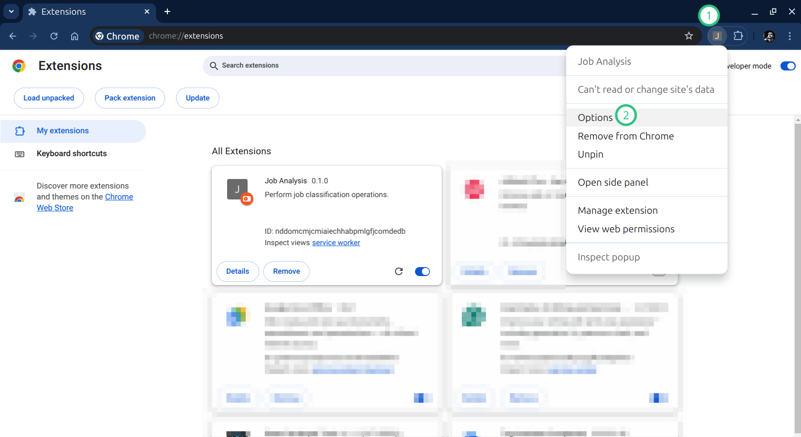

**Table of contents**
* [Installation](#installation)
* [Usage](#usage)
  * [Prerequisites](#prerequisites)
  * [Job offer analysis](#job-offer-analysis)
  * [The main panel](#the-main-panel)

# Why Job Analysis Chrome Extension

This Chrome Extension is meant to:

* 📊 Help you analyze the job market
* 🍰 Simplify the job searching process

You could find out, for example, that:

* 🌍 Berlin offers more full-remote jobs than Munich
* 📈 24% of job offers on Upwork are for website and CMS developers
* 💼 4.5% of job offers on LinkedIn come from the finance & insurance sector
* ... and much more

When you have this information, you can focus your energies on the right platform!\
Maybe on Stepstone there are more job offers for your desired role?

Once you know better the market, you can refine your search filters 🔍 and tailor your CV 📝 to target your ideal clients.\
🎯 Berliner startup in the finance sector?\
🕒 SMB part-time DevOps engineer?\
🏢 SAP consultant for corporates in the manufacturing field?\
You name it!

Once you have chosen your target client, refined your CV, found the best job platforms, 
and adjusted your filters, this extension will help you track down and identify the best offers for you. *

\* 🚧 This feature is under construction.

## Installation

Follow these easy steps:

1. 📂 Create a new folder on your computer where to install the extension 
(you can create it wherever you want, but if you are not sure, find the recommended folders a little down).
2. 📥 Download the zip file inside the newly created folder.
 
3. 🗜️ Extract the zip inside the dedicated new folder (double left click or right click and "extract here").
4. ✅ A new folder with the same name as the Zip should appear.
5. 🔨 Change the name of the folder to "ja-chrome-extension". (this will make updating the extension easier)
6. 🌐 Open your Chrome browser. 
7. Navigate to **[chrome://extensions](chrome://extensions)**
8. Enable Developer Mode by clicking the toggle switch next to **Developer mode**
9. Click the **Load unpacked** button and select the "ja-chrome-extension" directory
10. 🎉 The extension is now installed.

If you need more details check the official Chrome guide: [Load an unpacked extension instructions](https://developer.chrome.com/docs/extensions/get-started/tutorial/hello-world#load-unpacked).

|  |
|:----------------------------------------------:|
|  _How to enable and load unpacked extensions_  |

Recommended folders:

* 🐧 **Linux:** `/home/your-username/Documents/ja-chrome-extension`
* 💻 **Windows:** `C:\Users\YourUsername\Documents\ja-chrome-extension`
* 🍏 **macOS:** `/Users/YourUsername/Documents/ja-chrome-extension`

## Update

## Uninstall

## Usage

### Prerequisites

The first thing to do once the extension is installed is to set the API Key. 

To do that, first pin the extension 📍, then right-click on the extension icon and click Options.\
(Alternative: open the extensions menu, click on the three dots, and select Options)

|  |
|:-----------------------------:|
|      _Pin the extension_      |

|  |
|:---------------------------------------------:|
|     _Right click on the icon -> Options_      |

|          |
|:-----------------------------------------------------:|
| _(Alternative) Open options from the extensions list_ |

Once opened the Options page, enter your API Key and click Save.\
A success message should appear.

|  |
|:-----------------------------------------:|
|            _The options page_             |

Now you are ready to use the extension 🚀.

### Job Offer Analysis

The first thing you can do is analyze a job posting page.  
1. Open the page with your browser (* see note below)
2. **Right-click** on the page 
3. Hover over the **Job Analysis** menu item
4. And then select one of the following options:
   * 🧐 Analyze job 
   * 💾 Analyze and save job

\* Note: Fully open a job posting page, do not run the analysis on pages that contain multiple job previews e.g. linkedin.com/jobs/collections/#####. 
The right page in this case would be linkedin.com/jobs/view/#####.

|      |
|:---------------------------------------------------------:|
| _Right click on the page to see the Job Analysis actions_ |

**Analyze job** will perform the analysis for the current job posting page and display the results table.

|    |
|:-----------------------------------------------------:|
|    |
|               _Analysis result example_               |

You can choose to save the results in the current project 
(called "default" if you haven't configured it yet; more details on this later). 

**Analyze and save job** will perform the same operation and automatically save the result.

### The Main Panel

The main panel is the most important part of the extension.  
From here, you can manage all aspects of the plugin (except for the API key).

To open the main control panel, click on the plugin icon. A new panel should open on the right side of your screen.

|  |
|:-------------------------------------:|
|     _The main panel once opened_      |

From this panel, you can:

* **Configure the "Current Project"**: It acts as a folder for your data, and you can create multiple projects.
* **Manage the "Link Grabber"**: This feature grabs job posting links from the page while you navigate. It is available only on certain websites, but the list of supported websites is growing.
* **Manage the "Link Scraper"**: It opens the grabbed links in a new tab and extracts the job posting info for the next step: the analysis.
* **Manage the "Job Analyzer"**: This processes the job posting information collected in the previous step.
* **Download the Analysis Results**: By clicking the Download CSV button, you can export a CSV containing all the job posting analysis results. You can then import the file into your preferred CSV reader (Google Sheets, Excel, Open Office, etc.).